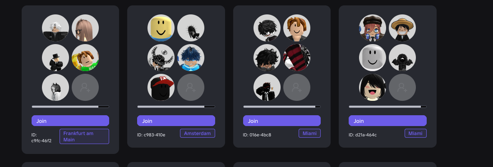
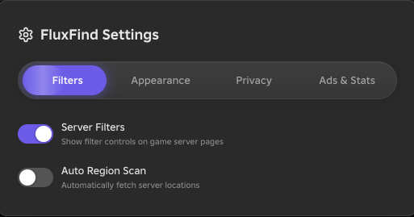

# FluxFind

<p align="center">
  
  
  
</p>

A userscript that enhances Roblox with region-filtered servers, live search with thumbnails, ad blocking, and dark mode - all free and open source.

<p align="center">
  <picture>
    <source media="(prefers-color-scheme: dark)" srcset="https://raw.githubusercontent.com/YuiElina/fluxfind/main/.github/assets/divider-dark.svg">
    
  </picture>
</p>

## Screenshots

<p align="center">
  
  
</p>

<p align="center">
  <picture>
    <source media="(prefers-color-scheme: dark)" srcset="https://raw.githubusercontent.com/YuiElina/fluxfind/main/.github/assets/divider-dark.svg">
    
  </picture>
</p>

## Features


### Server Browser
Find servers near you with region filtering, player thumbnails, and proximity-based sorting. Scan across countries to find the best ping.

### Smart Search
Search games and users live as you type - icons, player counts, and instant results without page reloads.

### Ad Remover
Strips promotional content from game pages and tracks how many ads have been blocked.

### Dark Mode
A proper dark theme across the entire Roblox experience.

### Hide Chat
Toggle the chat panel off when you want a distraction-free experience.

### Settings Panel
Animated pill-tab settings with persistent toggle state and a polished shine effect.

<br clear="right">

<p align="center">
  <picture>
    <source media="(prefers-color-scheme: dark)" srcset="https://raw.githubusercontent.com/YuiElina/fluxfind/main/.github/assets/divider-dark.svg">
    
  </picture>
</p>

## Installation

1. Install [Violentmonkey](https://violentmonkey.github.io/) or [Tampermonkey](https://www.tampermonkey.net/)
2. Grab `dist/fluxfind.user.js` from this repo, open it raw - your userscript manager will pick it up
3. Head to any game page on [roblox.com](https://www.roblox.com) and you are good to go

## Build

```bash
git clone https://github.com/YuiElina/fluxfind.git
cd fluxfind
npm install
npm run build
```

<p align="center">
  <picture>
    <source media="(prefers-color-scheme: dark)" srcset="https://raw.githubusercontent.com/YuiElina/fluxfind/main/.github/assets/divider-dark.svg">
    
  </picture>
</p>

## Project Structure

```
src/
  api/          Roblox API wrappers (games, thumbnails, geolocation)
  config/       Constants, region lists, URL patterns
  core/         DOM helpers, logger, sanitizer, state atoms, storage, utilities
  features/     Feature modules (ad-remover, server-browser, smart-search, url-router)
  state/        Reactive app state with automatic persistence
  types/        TypeScript type definitions
  ui/           Icons, modals, notifications, settings panel, CSS
```

<p align="center">
  <picture>
    <source media="(prefers-color-scheme: dark)" srcset="https://raw.githubusercontent.com/YuiElina/fluxfind/main/.github/assets/divider-dark.svg">
    
  </picture>
</p>

## Migrating from RoLocate

FluxFind automatically imports your RoLocate settings on first launch. Any `ROLOCATE_` keys in your browser storage are copied to `FLUXFIND_` and the old ones are cleaned up. This is a one-time migration that covers toggle settings (dark mode, ad blocking, region filter, server count).

Not every RoLocate feature was ported. The original is a 20,000-line single-file script with external dependencies for icons, flags, and region data. Features like the profile viewer, custom backgrounds, classic terms restorer, and settings export/import were either too tightly coupled to that architecture or did not fit FluxFind's modular design. These may return in future updates, rebuilt properly rather than simply copied over.

<p align="center">
  <picture>
    <source media="(prefers-color-scheme: dark)" srcset="https://raw.githubusercontent.com/YuiElina/fluxfind/main/.github/assets/divider-dark.svg">
    
  </picture>
</p>

## Roadmap

**Done (v0.1.0-alpha)**
- Server browser with region filtering, player thumbnails, and proximity sorting
- Smart search with live game and user results
- Ad remover with block statistics
- Dark mode
- Chat hiding
- Settings panel with toggle persistence
- Reactive state manager

**Planned**
- Bug fixes and UI polish
- Better thumbnail handling for servers
- Profile viewer
- Additional customization options
- Self-hosted geolocation (FluxGeo)
- Settings import/export

FluxFind is a side project. No promises on timelines, but all features will remain free forever.

<p align="center">
  <picture>
    <source media="(prefers-color-scheme: dark)" srcset="https://raw.githubusercontent.com/YuiElina/fluxfind/main/.github/assets/divider-dark.svg">
    
  </picture>
</p>

## License

[Authentic Open License (AOL-1.0)](https://github.com/YuiElina/AOL-LICENSE)